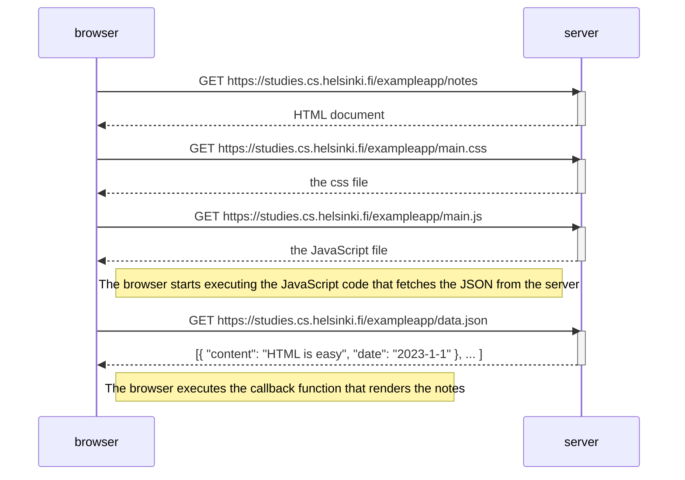
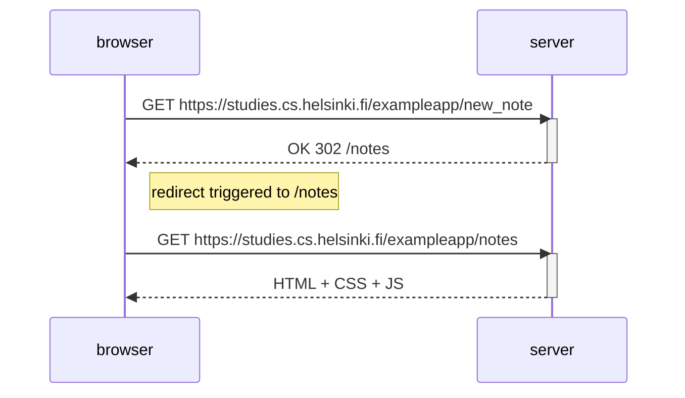
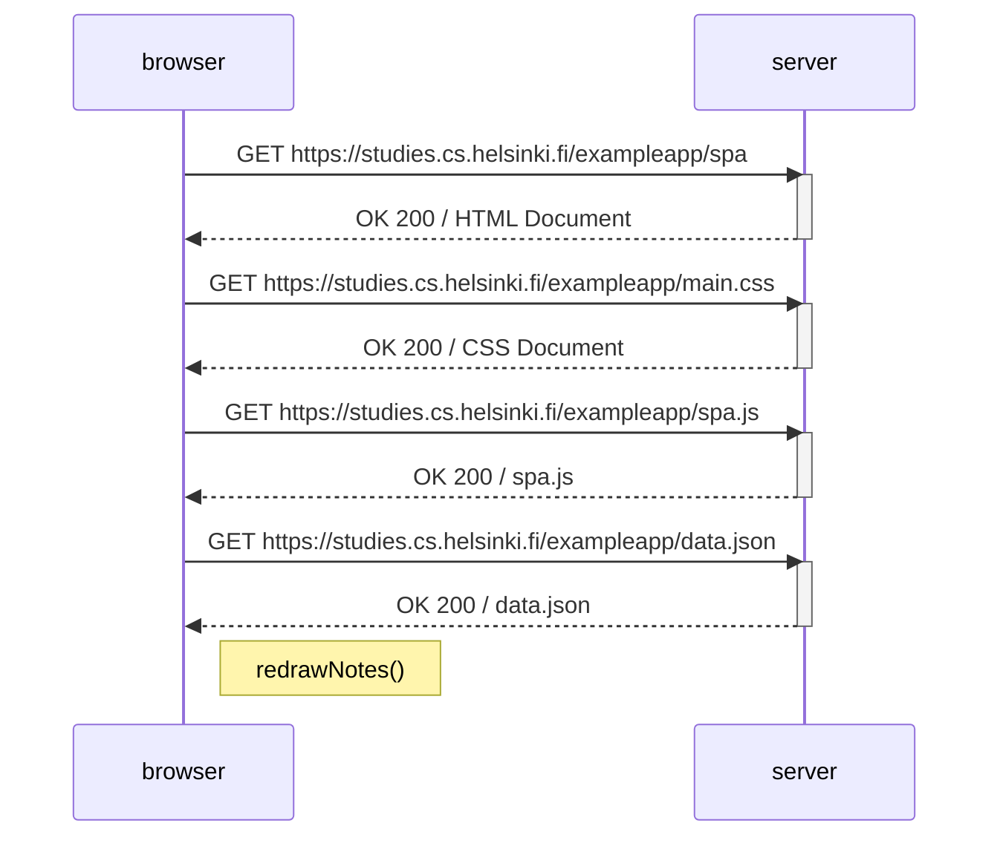
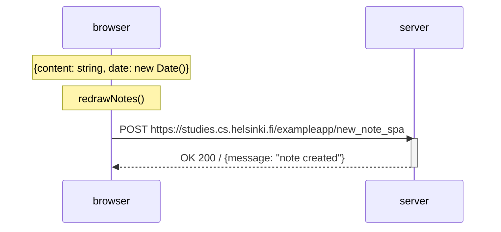

# 0.4 New Note sequence diagram  
  
## Original Diagram  

  
## Based on `new_note` flow:  

# 0.5: Single Page App diagram  
  
A version of the diagram in the case of the [notes](https://studies.cs.helsinki.fi/exampleapp/spa.) app in SPA form.  
  

# 0.6 Single Page App diagram when New Note is invoked  
  
